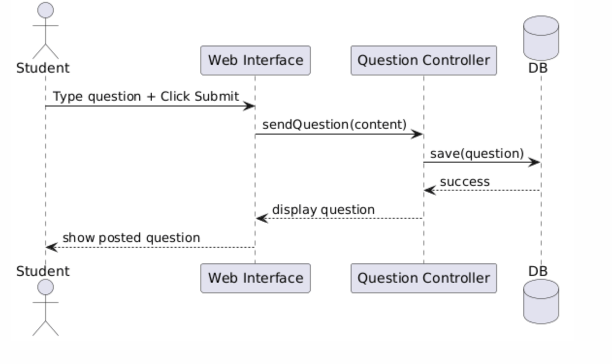
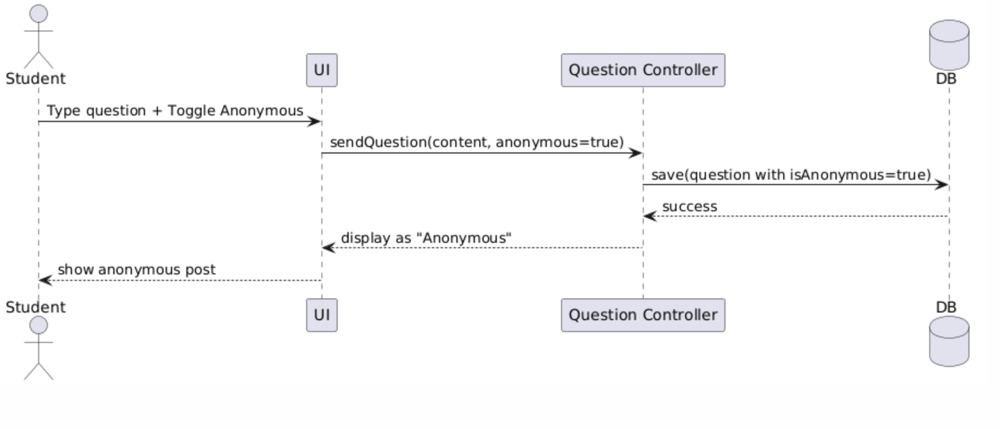

# UML Diagrams

This folder contains UML design artefacts for the Class Pulse system.

---

## D1 – Class Diagram

---

## D2 – Sequence Diagram – Submit Question

---

## D3 – Sequence Diagram – Anonymous Submission

---

## D4 – Sequence Diagram – Delete / Restore Question

---

## D5 – Use Case Diagram

