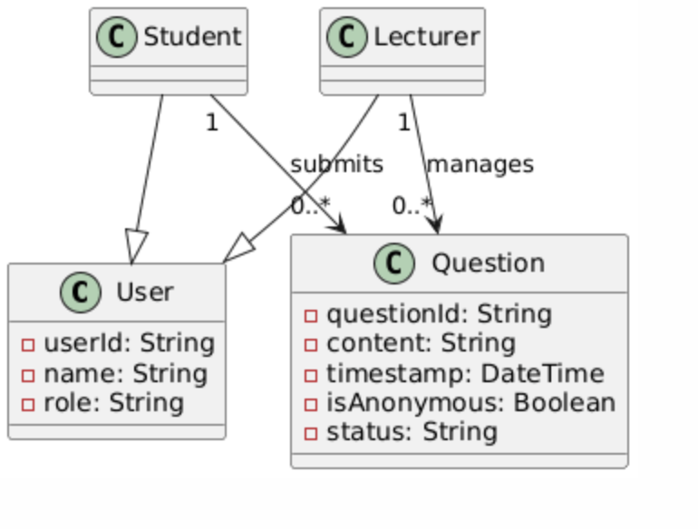
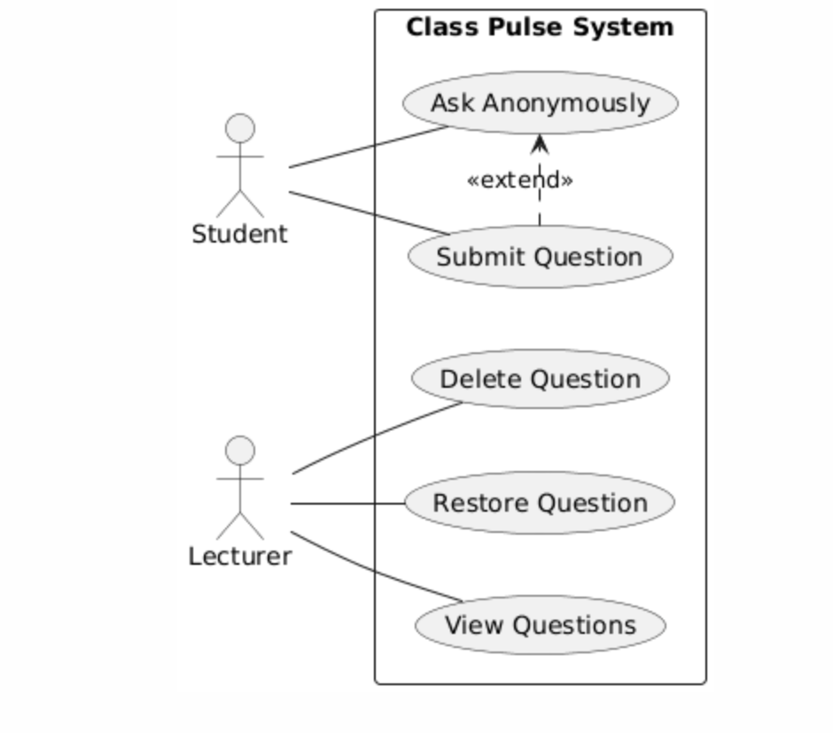

# UML Diagrams

This folder contains UML design artefacts for the Class Pulse system.

---

## D1 – Class Diagram

## D2 – Sequence Diagram – Submit Question
.png)

## D3 – Sequence Diagram – Anonymous Submission
.png)

## D4 – Sequence Diagram – Delete / Restore Question
.png)

## D5 – Use Case Diagram

